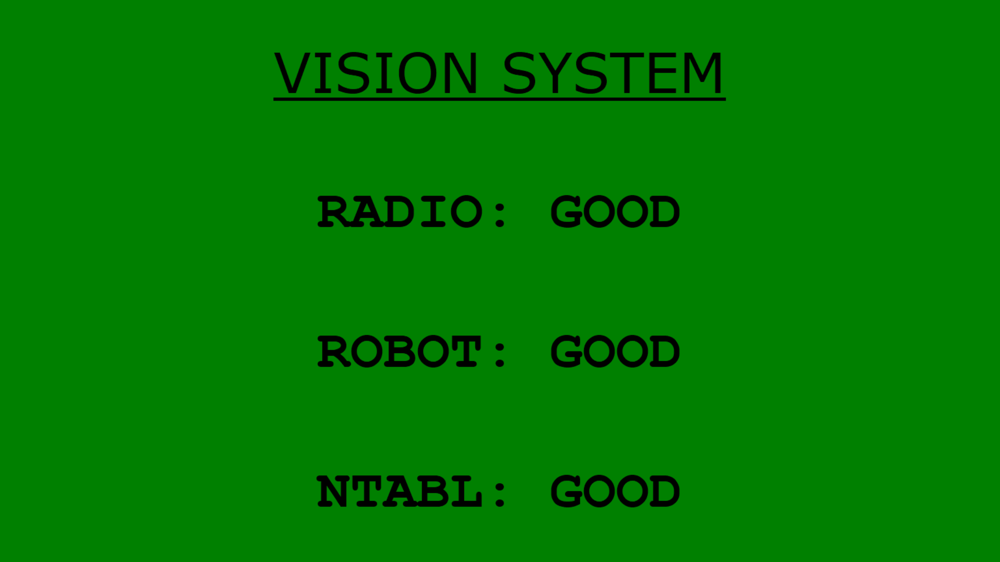
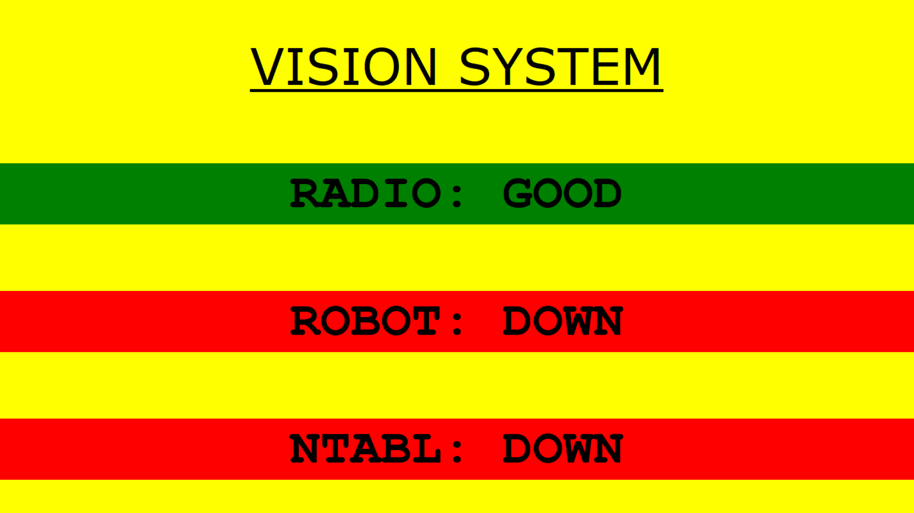
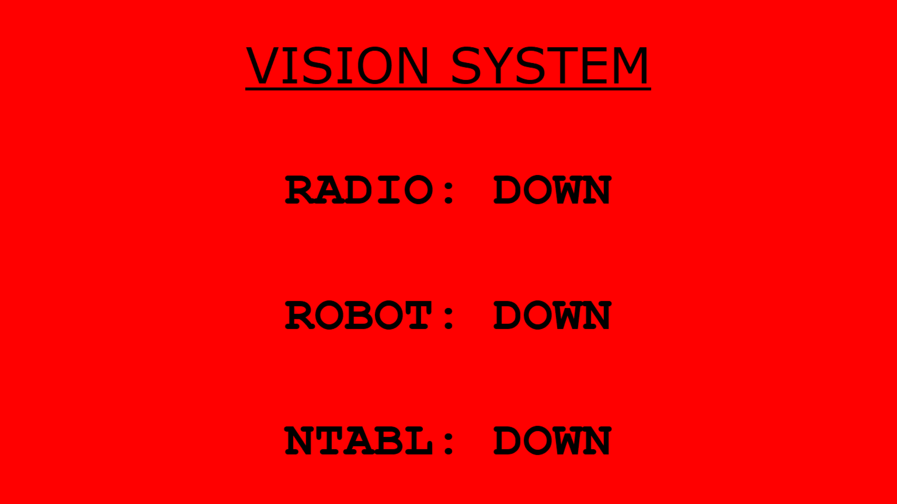

<p align="center">
    <a href="#"></a>
</p>

<p align="center">
    <a href="https://sert2521.org"></a>
    <a href="https://www.python.org/downloads"></a>
    <a href="https://github.com/SouthEugeneRoboticsTeam/vision/blob/master/LICENSE"></a>
    <a href="https://travis-ci.org/SouthEugeneRoboticsTeam/vision"></a>
</p>

## Usage

Before starting the program, you must install OpenCV >= v3.1.x along with
the pip dependencies:

```bash
$ pip install -r requirements.txt
```

Then, you can run the program using:

```bash
$ python run.py
```

Full usage:

```text
usage: run.py [-h] [-i IMAGE] [-s SOURCE] [-t TEAM] [-d] [-na MIN_AREA]
              [-xa MAX_AREA] [-nf MIN_FULL] [-xf MAX_FULL]
              [-l LOWER_COLOR [LOWER_COLOR ...]]
              [-u UPPER_COLOR [UPPER_COLOR ...]] [-tn] [-v]
```

## Usage with Docker

If you are using Docker, the installation process is much easier.

Note: due to the sizes of the images that are installed as part of the build process, it is recommended to have a few GB of hard disk space available when building.

First, `cd` to this repository and then run `docker build . -t vision`. All existing config files will be used in the build process to make the image.

This will produce a docker image which can be run using:

```
docker run --device /dev/video0 vision
```

Make sure that you have a camera connected before running this!

## Connection Status GUI

SERT's vision software comes with a connection status GUI to help debug
connection issues. This GUI can be displayed on a monitor connected to
the co-processor. We use an [Adafruit 5" screen](https://www.adafruit.com/product/2260).

| Good    | Warning | Bad     |
|---------|---------|---------|
| Connection is good and system is ready. | Some connections are down. | No connection. Ensure ethernet is plugged in. |
||||

## Configuration

### Command-Line Options

All command-line arguments may be configured in the `config.ini` file
(located at `config/config.ini`). For example, the `--lower-rgb`
argument may be edited using the `lower-rgb` line in the `config.ini`.

```text
optional arguments:
  -h, --help            show this help message and exit
  -i IMAGE, --image IMAGE
                        path to image
  -s SOURCE, --source SOURCE
                        video source (default=0)
  -t TEAM, --team TEAM  the team of the target roboRIO
  -d, --display         display results of processing in a new window
  -na MIN_AREA, --min-area MIN_AREA
                        minimum area for blobs
  -xa MAX_AREA, --max-area MAX_AREA
                        maximum area for blobs
  -nf MIN_FULL, --min-full MIN_FULL
                        minimum fullness of blobs
  -xf MAX_FULL, --max-full MAX_FULL
                        maximum fullness of blobs
  -l LOWER_COLOR [LOWER_COLOR ...], --lower-color LOWER_COLOR [LOWER_COLOR ...]
                        lower color threshold in HSV
  -u UPPER_COLOR [UPPER_COLOR ...], --upper-color UPPER_COLOR [UPPER_COLOR ...]
                        upper color threshold in HSV
  -tn, --tuning         open in tuning mode
  -v, --verbose         for debugging, prints useful values
```

### Camera

For use with the Microsoft Lifecam 3000, the camera's exposure should be
set manually because the Lifecam will auto-adjust otherwise, making
thresholding difficult. This can be done with V4L:

```bash
$ sudo apt-get install v4l-utils
$ v4l-ctl -d /dev/video0 -c exposure_auto=1 # 1=DISABLED, 3=ENABLED
$ v4l-ctl -d /dev/video0 -c exposure_absolute=50
```
